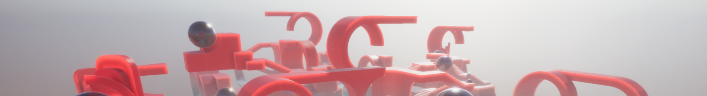

# DOTS Sample


## Overview

The purpose of this project is to test and demonstrate the new packages from
the Unity DOTS tech stack in a single place. Currently, the major ones are:

  * Unity Animation
  * Unity Transport and Unity NetCode
  * Unity Physics
  * Entities with conversion workflow and Unity Live Link
  * Hybrid Renderer (HDRP)

## Supported platforms, requirements and Unity versions

Currently the project supports these:
```
Unity: 2019.3.0f3
Platforms: Windows and MacOS
```

***Note*** This project is using the Burst compiler and for now you need to make
sure you have the following prerequisites: https://docs.unity3d.com/Packages/com.unity.burst@1.2/manual/index.html#burst-aot-requirements

***Known issue***: Be aware that with the first versions of MacOS 10.15 there is a known crash on certain
MacBook Pro's (e.g. the 2015 model). This issue will take down the entire OS so be sure
to upgrade to at least 10.15.2 where it was fixed.

## Opening the project for the first time

The following steps should bring you to a state where you can run the
game in the editor, build standalone players as well as servers and see
live link in action.

* Get the right version of Unity. (see above)

* Open the project. After import, go to `Assets/Scenes/`
  and open a scene, e.g. `Whitebox_Arena_A/Whitebox_Arena_A.unity`

* You can now enter play mode and should be able to play the game.

* Opening
  the window "Multiplayer > PlayMode Tools" give you options for what happens
  when you enter play mode. By default it will say "Client and Server" which
  means that play mode will host two worlds, a client and a server.
  We will get back to more of these options, but for now you can try requesting a few
  "thin clients". If you put a (not too big!) number in the "Num Thin Clients" field
  before entering play mode, you should get a bunch of 'dumb bots' clients
  that simply run around in circles and shoot.

* ***Known issue***: The option "Num Clients" is not working properly at this time.


## Making stand alone builds

* ***Note*** There is some automation to help doing these steps on a daily
  basis (check out A2 > Windows > Launch Window) but it is useful to know what
  happens under the hood, so this guide shows the manual steps.

* To make a standalone build, locate Assets/BuildsSettings folder in the Project
  tab and select `Win-Server` or `OSX-Server` depending on your OS. In the
  Inspector window, change the drop-down button at the top to "Build" and press
  it to generate a standalone server build. Do the same with `Win-Client` / 
  `OSX-Client`.

* ***Known Issue***: Make sure the scene you have open when you do this have no unsaved
  modification. If it has, build will fail.
   
* Once both have been built, the next steps will spin up a server and launch
  a client and connect to it. Use Explorer (Win), Finder (OSX) or a command prompt
  to locate the builds. They are found in a folder called `build` next to your
  `Assets` folder.
  
* Launch the server executable. You should see the game console open (toggle
  it using F1). On the console, type `serve whitebox_basic_a`. The server 
  will load the level and be ready to accept connections.

* Launch the client executable. On the console type `connect localhost` to
  connect the client to the server.

* ***Known Issue***: On MacOS there will be HUD and black screen only shown on the client
  for up to 10 minutes the first time the game is launched. (If you press esc and open the
  settings menu for the game, switching to Low graphics quality setting might clear this up
  and save you the wait!)
    
* You can connect more clients; and if you want to do some automation,
  arguments passed to the standalone players with the prefix `+` will be
  executed on the console, so for example (on Windows) `DotsSample.exe +serve whitebox_arena_a`
  can be used to start a server that is hosting a game on whitebox_arena_a.


## Making stand alone builds for use with Live Link

***Note*** The live link feature is still at an early stage. Currently you need to use a
special set of build configurations when making standlone builds. The following steps will
show you the live link in action.

* Make builds using the Win-Server-LiveLink resp. Win-Client-LiveLink buildsettings.

* Open the scene you want to play in the editor, e.g. whitebox_arena_a. Select one of the
  subscenes, e.g. 020_Environment and click "Edit".

* Launch the livelink standalone server and type `serve whitebox_arena_a`. Launch livelink
  standalone client and connect to server.

* Move some stuff around in the editor etc.

***Known issue*** Currently, when you open a subscene in the editor while livelink player is
attached, all the entities in that scene is 'recreated' so they get a new entity id. This means
any references your code might hold to those entities will become invalid. This will be fixed
in the future. For now this means, that you cannot successfully open the scene
`PrefabAssetRegistry` in this project while the player is running.

***Known issue*** Sometimes the connection between the live link player and the editor will not succeed. The player will say `Initializing live link` but not get
any further. A workaround, until this is fixed, is to reboot the machine.


## A few remarks on multiplayer testing

* If you want to use the editor as either a client or a server, the Multiplayer > PlayMode Tools
  window can be used. By default entering play mode will run a client and a server world.

* As an example, you can launch a standalone server. Then in the editor in the PlayMode tools
  select Client and type `127.0.0.1` as the server it should connect to. When you enter
  playmode, the editor will now act as a client and connect to the server.

* When running as client in the editor, you can access some network stats by opening in a
  browser the file `ModifiedPackages/com.unity.netcode/Runtime/Stats/netdbg.html` and connect
  to the editor/client.

## Tips for getting better performance in the editor  

When running the project in the editor, there are a few things you can do to improve
the performance. The most impactful is to disable editor attaching (the ability to attach a
debugger to the editor). You can do that in Editor > Preferences > External Tools.
Also, it is worth turning off Leak detection (Jobs > Leak Detection), Burst checks
(Jobs > Burst > Safety ) and the jobs
debugger (Jobs > Jobs Debugger). If you do not need to look at the game view and the scene
view at the same time, it can also help to close the scene view or put it in a tab behind
the game view when in play mode.

Be aware that the burst compiler is compiling code in the background so when you enter
playmode it can take a while for full performance to be achieved. Turning on Burst timings
(Jobs > Burst > Show Timings) will give you a log item for each completed burst code piece.
When they stop appearing everything is bursted and performance is as good as it gets.
If you prefer, you can also turn on Jobs > Burst > Synchronous Compilation which will wait for
all burst compilations to finish before entering play mode.

At present, the project is configured with the define `ENABLE_SIMPLE_SYSTEM_DEPENDENCIES` that was introduced in entities version 0.3. This provides better performance in the editor since most gamecode is still tied to
the main thread. See the changelog of entities 0.3.0 for more information.

## Caveats and known issues

  This project represents a snapshot of our efforts to bring many of the new
  technologies together in a single project. It depends on many packages that are
  still in experimental stage so there will be API changes as well as changes
  to best practices going forward from here.

  In addition, the project history means that parts of the code come from a more
  'classic' Unity approach and is in the process of being converted to the new
  programming style of entities etc.

  Here are some specific examples of areas that are known to be far from the
  target still:

* Overall performance. There are still many areas that need to be optimized.
  Expect lots of improvements here.

* Handling of dynamically spawned assets is rudimentary still. This is why we
  currently have the temporary solution of keeping the subscene PrefabAssetRegistry
  in all levels.

* This sample is not about visual fidelity and the featureset of the hybrid HDRP
  rendering is still under development.

